# GumBOTchi

Your other bots can't say howdy can they?

## Howdy
`/howdy` is the cooler version of `/ping` and you know it. Can be used to check GumBOTchi's pulse.  
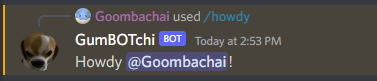  

## Pog  
Pog functionality is a random automatic response to someone saying "pog" or some variant of it. This can be used with messages or links.  
Responses are custom per discord server so you manage the responses yourself using `/pog` commands.  
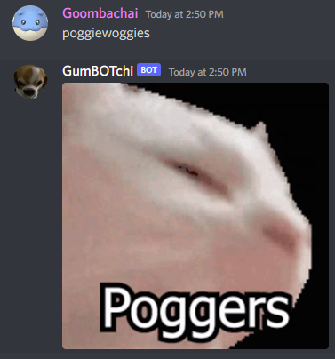
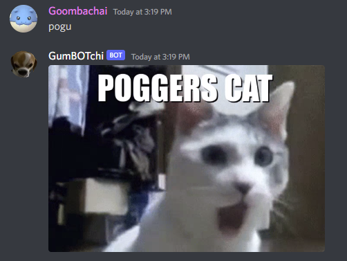  

## Sbonks  
Sbonks is a listener that responds with a graph after somebody types a stock symbol prefixed with a `$`  
There is also a `/sbonk` command that allows for timeframe and other things like a message   
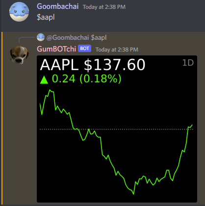
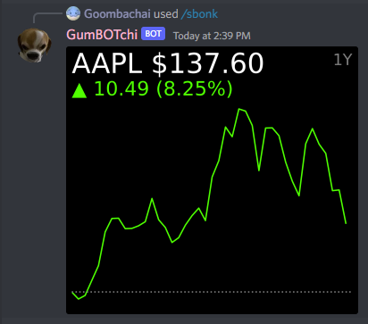  

## Craigslister  
Sweet will fill this section in I just know it  
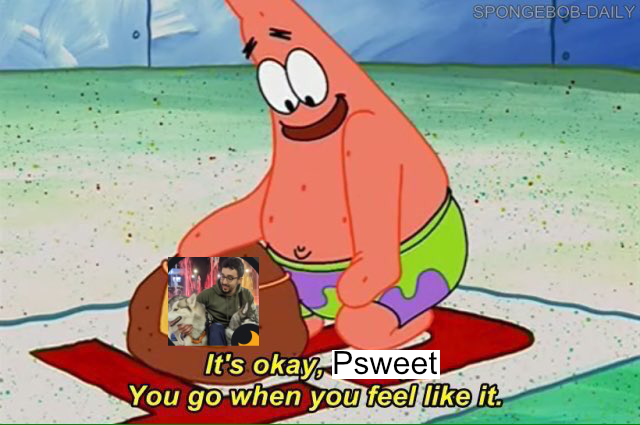  

## Games  
GumBOTchi has some games you can play against your friends or against GumBOTchi.  
You can do this by `right clicking your opponent's picture/name > Apps > Game of Your Choice`  
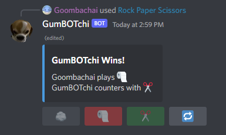  
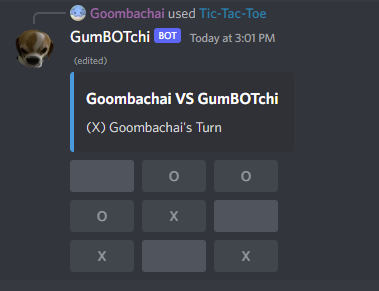 
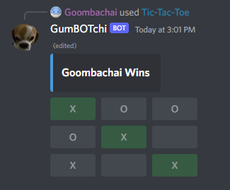  
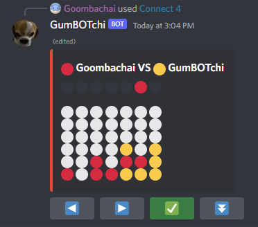  

## Music
GumBOTchi has a very forward thinking music player. There is no `/play` command its just `/jukebox` once and go from there.  
Everything is controlled from the jukebox which reduces channel clutter  
Songs can be controlled and managed with the provided buttons  
 - Repeat button to cycle throught repeat types such as repeat and repeat one to loop the current queue
 - Play/Pause button to pause/resume the current song
 - Add button to add a song to the queue
 - Skip/Rewind to move to the next song or to reset the current song
 - Queue is paginated and can be navigated using the left/right buttons 

You can also queue previously played songs using the history select box.  
Just click one of the songs in the list and it will be requeued.  

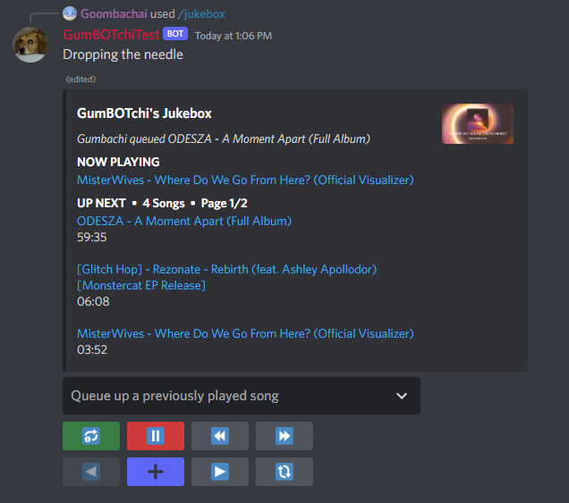 

## Invite GumBOTchi

 - TODO
